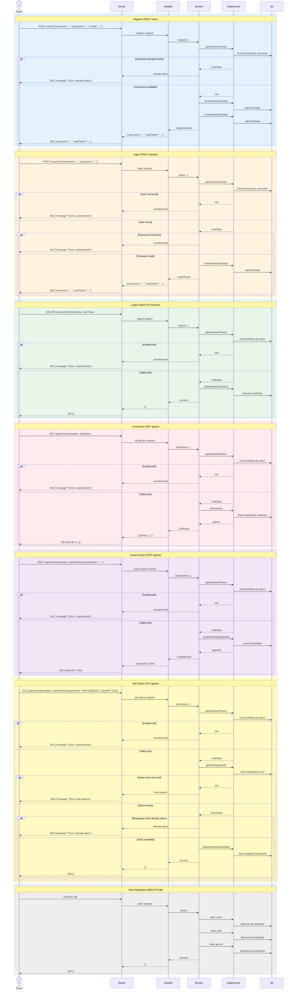

```mermaid
sequenceDiagram
    actor Client
    participant Server
    participant Handler
    participant Service
    participant DataAccess
    participant DB as db

    rect rgb(227, 242, 253)
        Note over Client,DB: Register (POST /user)
        Client->>Server: POST /user\n{"username":"...","password":"...","email":"..."}
        Server->>Handler: register request
        Handler->>Service: register(...)
        Service->>DataAccess: getUser(username)
        DataAccess->>DB: Find UserData by username
        alt Username already exists
            DataAccess-->>Service: UserData
            Service-->>Server: already taken
            Server-->>Client: 403 {"message":"Error: already taken"}
        else Username available
            DataAccess-->>Service: null
            Service->>DataAccess: createUser(userData)
            DataAccess->>DB: Add UserData
            Service->>DataAccess: createAuth(authData)
            DataAccess->>DB: Add AuthData
            Service-->>Handler: RegisterResult
            Handler-->>Server: {"username":"...","authToken":"..."}
            Server-->>Client: 200 {"username":"...","authToken":"..."}
        end
    end

    rect rgb(255, 243, 224)
        Note over Client,DB: Login (POST /session)
        Client->>Server: POST /session\n{"username":"...","password":"..."}
        Server->>Handler: login request
        Handler->>Service: login(...)
        Service->>DataAccess: getUser(username)
        DataAccess->>DB: Find UserData by username
        alt User not found
            DataAccess-->>Service: null
            Service-->>Server: unauthorized
            Server-->>Client: 401 {"message":"Error: unauthorized"}
        else User found
            DataAccess-->>Service: UserData
            alt Password mismatch
                Service-->>Server: unauthorized
                Server-->>Client: 401 {"message":"Error: unauthorized"}
            else Password valid
                Service->>DataAccess: createAuth(authData)
                DataAccess->>DB: Add AuthData
                Service-->>Handler: LoginResult
                Handler-->>Server: {"username":"...","authToken":"..."}
                Server-->>Client: 200 {"username":"...","authToken":"..."}
            end
        end
    end

    rect rgb(232, 245, 233)
        Note over Client,DB: Logout (DELETE /session)
        Client->>Server: DELETE /session\nAuthorization: authToken
        Server->>Handler: logout request
        Handler->>Service: logout(...)
        Service->>DataAccess: getAuth(authToken)
        DataAccess->>DB: Find AuthData by token
        alt Invalid auth
            DataAccess-->>Service: null
            Service-->>Server: unauthorized
            Server-->>Client: 401 {"message":"Error: unauthorized"}
        else Valid auth
            DataAccess-->>Service: AuthData
            Service->>DataAccess: deleteAuth(authToken)
            DataAccess->>DB: Remove AuthData
            Service-->>Handler: success
            Handler-->>Server: {}
            Server-->>Client: 200 {}
        end
    end

    rect rgb(255, 235, 238)
        Note over Client,DB: List Games (GET /game)
        Client->>Server: GET /game\nAuthorization: authToken
        Server->>Handler: list games request
        Handler->>Service: listGames(...)
        Service->>DataAccess: getAuth(authToken)
        DataAccess->>DB: Find AuthData by token
        alt Invalid auth
            DataAccess-->>Service: null
            Service-->>Server: unauthorized
            Server-->>Client: 401 {"message":"Error: unauthorized"}
        else Valid auth
            DataAccess-->>Service: AuthData
            Service->>DataAccess: listGames()
            DataAccess->>DB: Read GameData collection
            DataAccess-->>Service: games
            Service-->>Handler: ListResult
            Handler-->>Server: {"games":[...]}
            Server-->>Client: 200 {"games":[...]}
        end
    end

    rect rgb(243, 229, 245)
        Note over Client,DB: Create Game (POST /game)
        Client->>Server: POST /game\nAuthorization: authToken\n{"gameName":"..."}
        Server->>Handler: create game request
        Handler->>Service: createGame(...)
        Service->>DataAccess: getAuth(authToken)
        DataAccess->>DB: Find AuthData by token
        alt Invalid auth
            DataAccess-->>Service: null
            Service-->>Server: unauthorized
            Server-->>Client: 401 {"message":"Error: unauthorized"}
        else Valid auth
            DataAccess-->>Service: AuthData
            Service->>DataAccess: createGame(gameData)
            DataAccess->>DB: Insert GameData
            DataAccess-->>Service: gameID
            Service-->>Handler: CreateResult
            Handler-->>Server: {"gameID":1234}
            Server-->>Client: 200 {"gameID":1234}
        end
    end

    rect rgb(255, 249, 196)
        Note over Client,DB: Join Game (PUT /game)
        Client->>Server: PUT /game\nAuthorization: authToken\n{"playerColor":"WHITE|BLACK","gameID":1234}
        Server->>Handler: join game request
        Handler->>Service: joinGame(...)
        Service->>DataAccess: getAuth(authToken)
        DataAccess->>DB: Find AuthData by token
        alt Invalid auth
            DataAccess-->>Service: null
            Service-->>Server: unauthorized
            Server-->>Client: 401 {"message":"Error: unauthorized"}
        else Valid auth
            DataAccess-->>Service: AuthData
            Service->>DataAccess: getGame(gameID)
            DataAccess->>DB: Find GameData by ID
            alt Game does not exist
                DataAccess-->>Service: null
                Service-->>Server: bad request
                Server-->>Client: 400 {"message":"Error: bad request"}
            else Game exists
                DataAccess-->>Service: GameData
                alt Requested color already taken
                    Service-->>Server: already taken
                    Server-->>Client: 403 {"message":"Error: already taken"}
                else Color available
                    Service->>DataAccess: updateGame(gameData)
                    DataAccess->>DB: Save updated GameData
                    Service-->>Handler: success
                    Handler-->>Server: {}
                    Server-->>Client: 200 {}
                end
            end
        end
    end

    rect rgb(238, 238, 238)
        Note over Client,DB: Clear Application (DELETE /db)
        Client->>Server: DELETE /db
        Server->>Handler: clear request
        Handler->>Service: clear()
        Service->>DataAccess: clear users
        DataAccess->>DB: Remove all UserData
        Service->>DataAccess: clear auth
        DataAccess->>DB: Remove all AuthData
        Service->>DataAccess: clear games
        DataAccess->>DB: Remove all GameData
        Service-->>Handler: success
        Handler-->>Server: {}
        Server-->>Client: 200 {}
    end
```